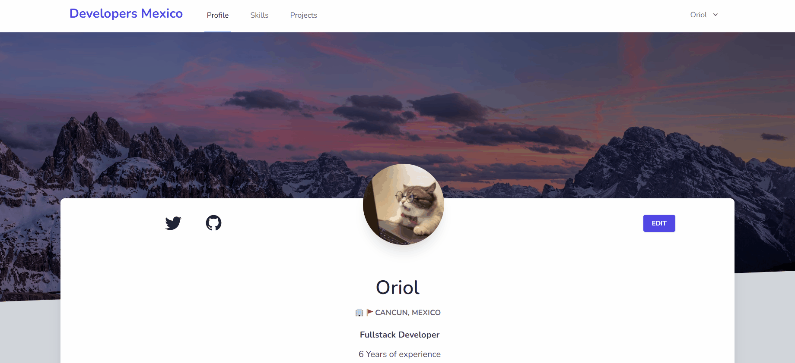
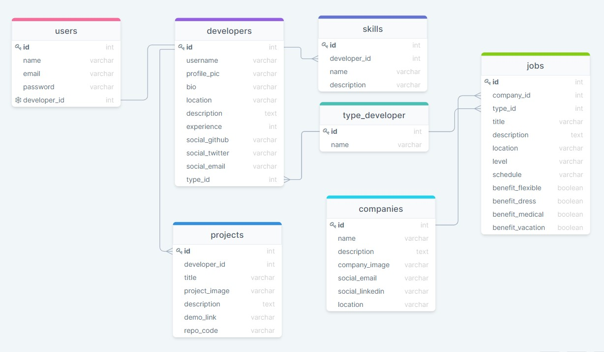

## Developers Mexico 📕😎👍

This is a fiction developer portal named "Developers Mexico" where you can view developers and companies from different cities of Mexico it was built with the purpose to practice my Laravel 8 skills + the implementation of a front-end framework named "Vuejs" making it a Single-Page-Application.

### Features ✔
* Login session using laravel default scaffolding.
* Create, Read, Update, Delete functionality for Skills, Projects, Jobs.
* Single Page Application using VueJS front-end framework.
* Database One-to-Many, One-to-Many relationship.
* Filter search
* Tailwindcss front-end framework.
* Responsive webpage.

## Build with 🛠️
* [MYSQL](https://www.mysql.com) - Data Base.
* [PHP-v8.0.0](https://www.php.net) - Backend Programming Language.
* [Tailwindcss](https://tailwindcss.com/) - Frontend styling framework.
* [Laravel 8.51.0](https://laravel.com) - Backend Framework.
* [VueJS-2.6.12](https://vuejs.org/) - Front-End Framework.
* [Authentication](https://laravel.com/docs/7.x/authentication) - Laravel default scaffolding.

### Author 
[@Dev-OriolCC](https://github.com/Dev-OriolCC)

## Screenshots and gifs 📸

### Login
Username: oriol@mail.com
Password: oriolcesar
